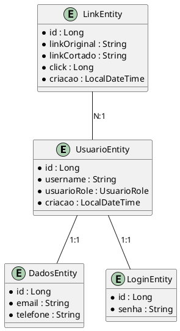
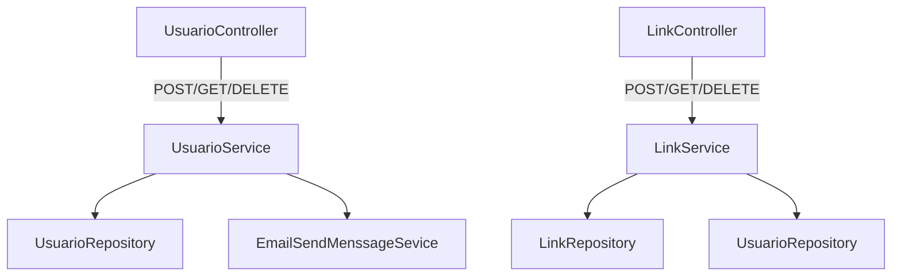

# CortaLink

## Visão Geral do Projeto
CortaLink é uma aplicação Spring Boot para gerenciamento e encurtamento de links, com autenticação de usuários e estatísticas. Utiliza MySQL como banco de dados e segue uma estrutura modular para facilitar manutenção e escalabilidade.

## Tecnologias Utilizadas
- Java 21
- Spring Boot 3.5.4
- Spring Data JPA
- Spring Web
- Spring Validation
- MySQL
- Maven

## Estrutura de Pastas
```
CortaLink/
├── src/
│   ├── main/
│   │   ├── java/
│   │   │   └── com/gabriel/CortaLink/
│   │   │       ├── controller/         # Controladores REST
│   │   │       ├── entity/             # Entidades JPA
│   │   │       ├── enums/              # Tipos Enum
│   │   │       ├── records/DTO/        # DTOs (Data Transfer Objects)
│   │   │       ├── regex/              # Utilitários de Regex
│   │   │       ├── repository/         # Repositórios Spring Data
│   │   │       ├── service/            # Camada de serviços
│   │   │       └── CortaLinkApplication.java # Classe principal
│   │   └── resources/
│   │       ├── application.properties  # Configuração
│   │       ├── static/                 # Arquivos estáticos
│   │       └── templates/              # Templates
│   └── test/
│       └── java/com/gabriel/CortaLink/ # Testes
├── pom.xml                             # Configuração Maven
└── README.md                           # Documentação do projeto
```

## Diagrama ER do Banco de Dados



## Fluxograma da Aplicação



**Explicação do fluxo:**
- O UsuarioController recebe requisições de criação, consulta e exclusão de usuários.
- O UsuarioService processa a lógica e, ao criar um usuário, verifica se deve enviar e-mail (campo isEmailMenssage). Se SIM, chama o EmailSendMenssageSevice para simular o envio.
- O LinkController gerencia links, chamando o LinkService, que interage com LinkRepository e, se necessário, com UsuarioRepository.

## Como Executar
1. Instale Java 21 e Maven.
2. Configure o banco MySQL em `src/main/resources/application.properties`.
3. Execute `mvn spring-boot:run` para iniciar a aplicação.
4. Acesse os endpoints via REST (veja os controllers para rotas).


## Contribuição & Aceite
- Melhorias e pull requests são bem-vindos!
- Siga a estrutura de pastas e o padrão de código.
- Documente novas funcionalidades e atualize o README.


## Licença
MIT (ou especifique sua licença)

---
**Modificações e contribuições são aceitas!**

Para dúvidas ou sugestões, abra uma issue ou entre em contato com o mantenedor.
